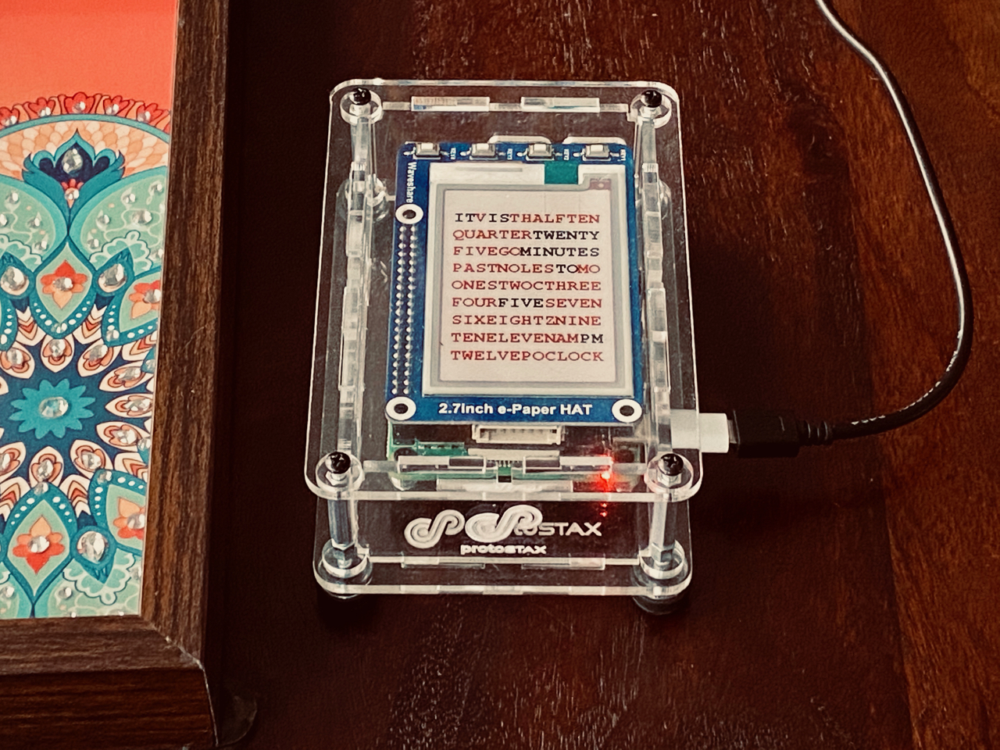

# ProtoStax_Word_Clock
Demo for ProtoStax Word Clock with ePaper Display and Raspberry Pi




using [ProtoStax for Raspberry Pi B+](https://www.protostax.com/products/protostax-for-raspberry-pi-b)

## Prerequisites

* Enable SPI on the Raspberry P
* Python 3 or higher. The code and the ePaper library assumes you are
  using Python 3 or higher! (with Raspbian Buster, the latest is
  Python3.7)

**Install spidev, RPi.gpio and Pillow**

```
sudo apt-get install python3-spidev
sudo apt-get install rpi.gpio
sudo apt-get install python3-pil
```


## Installing

This demo uses Waveshare's ePaper libary - see
[https://github.com/waveshare/e-Paper](https://github.com/waveshare/e-Paper)

but includes the necessary files from that library directly, so you
**don't need to install anything extra**!

**NOTE - Use sudo pip3!**

```
git clone https://github.com/protostax/ProtoStax_Word_Clock.git
```

## Usage

```
cd ProtoStax_Word_Clock
```

**NOTE - Using Python 3 or higher!**

```
python3 word_clock_paper.py
```

The program will run every 5 minutes, updating the word clock
display. The word clock has a granularity of 5 minutes or more
(i.e. "Five minutes to 4 am", or "10 minutes past 3 pm"), so the
program goes to sleep for 5 minutes, wakes up and updates the clock
again. Any shorter duration is unnecessary.

###TEST-MODE###

To run in "test-mode" (test with any given hour, minute and second)
```
python3 word_clock_paper.py <HOUR> <MINUTE> <SECOND>
```

(replace <HOUR>, <MINUTE> and <SECOND> with your values of choice)

In "test-mode" the script will run exactly once. 

## License

Written by Sridhar Rajagopal for ProtoStax. BSD license, all text above must be included in any redistribution

A lot of time and effort has gone into providing this and other code. Please support ProtoStax by purchasing products from us!
Also uses the Waveshare ePaper library. Please support Waveshare by purchasing products from them!


